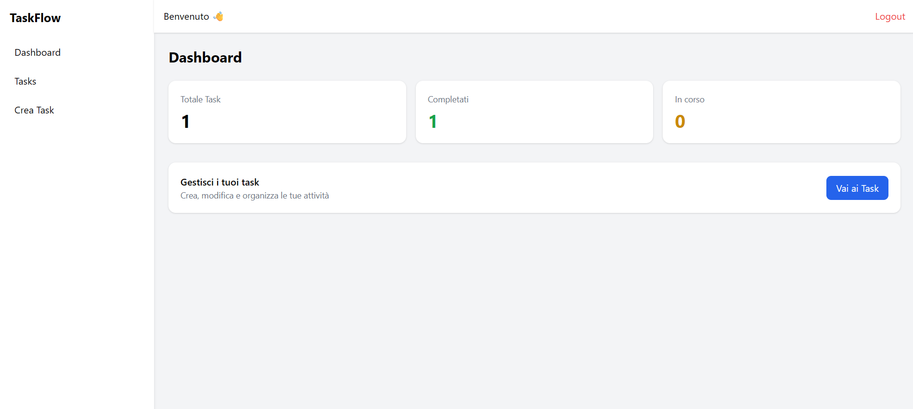
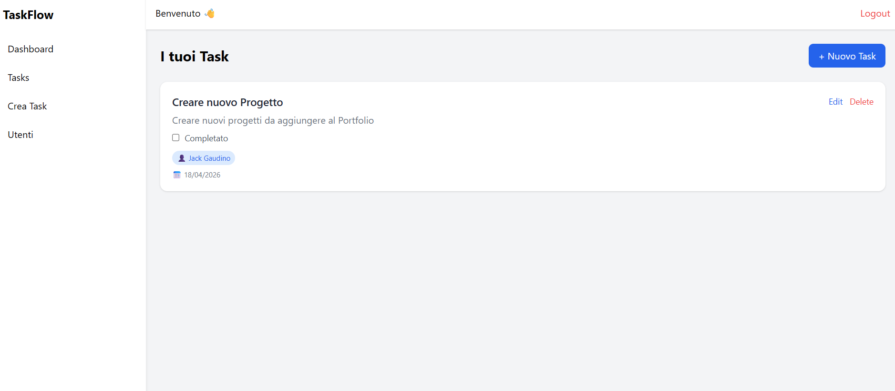
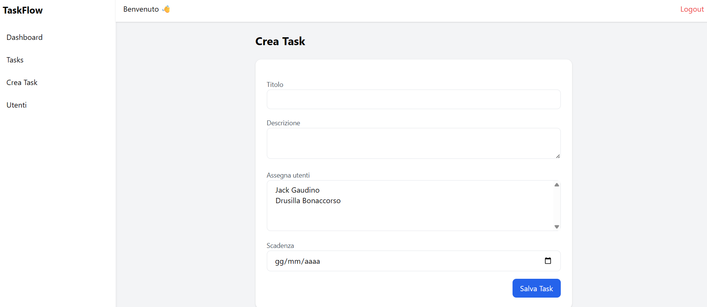
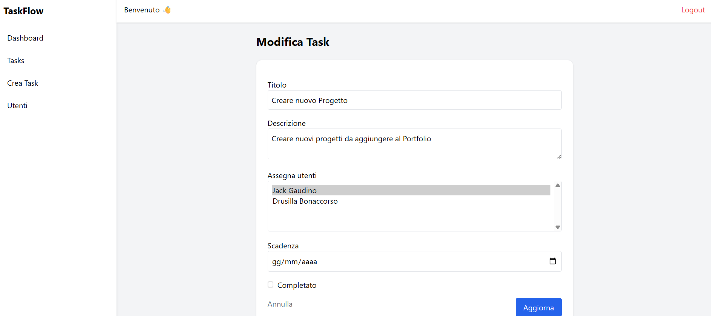
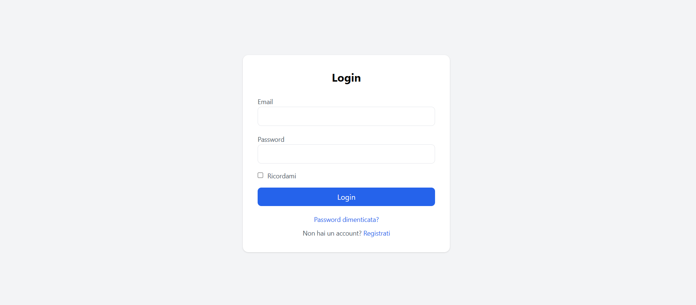
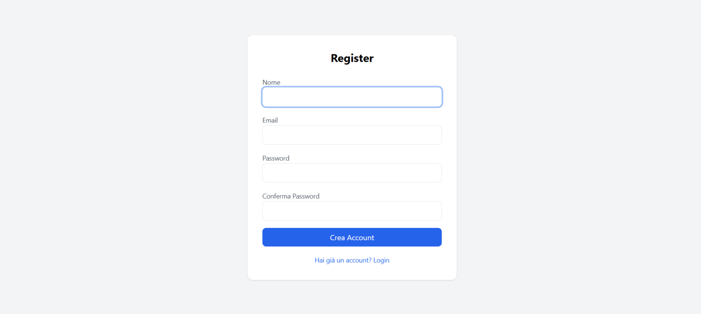
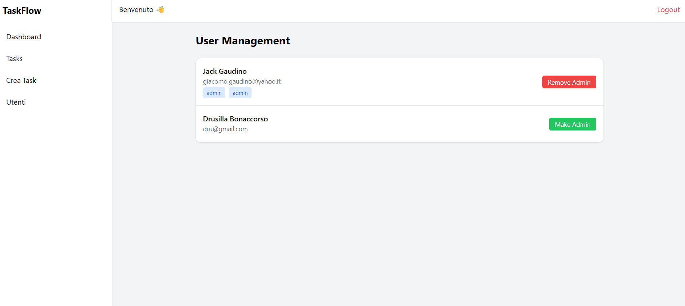

# TaskFlow

A full-stack task management application inspired by modern tools like Asana, designed to manage projects, tasks, and workflows efficiently.

---

## 🚀 Overview

TaskFlow is a web application that allows users to create, organize, and track tasks across different stages of completion.

The goal of this project was to build a realistic, business-oriented system that reflects how task management tools work in real-world environments, including authentication, structured workflows, and scalable architecture.

---

## 🎯 Key Features

* User authentication (Laravel Breeze)
* Create, update, delete tasks (CRUD operations)
* Task status management (To Do, In Progress, Done)
* Project-based organization
* Protected routes and access control
* RESTful API structure
* Clean and responsive UI

---

## 🧠 What I Built and Learned

This project was developed to strengthen my understanding of:

* Laravel MVC architecture
* Eloquent relationships and data modeling
* REST API design
* Authentication and route protection
* Structuring a scalable backend
* Managing state and workflows in a real application

I focused on writing clean, maintainable code and organizing the project in a way that reflects real development practices.

---

## ⚙️ Tech Stack

* Backend: Laravel (PHP)
* Frontend: Blade + Tailwind CSS
* Database: MySQL
* Authentication: Laravel Breeze

---

## 🏗️ Project Structure

The application follows a standard Laravel structure:

* `app/` → Models, Controllers, Business Logic
* `routes/` → Web and API routes
* `resources/views/` → Blade templates
* `database/` → Migrations and seeders

---

## 🖥️ Demo

[Add your live demo link here]

Demo credentials (optional):

* Email: [test@example.com](mailto:test@example.com)
* Password: password

---

## 📦 Installation

Clone the repository:

```bash
git clone https://github.com/GiacomoGaudino/TaskFlow.git
cd TaskFlow
```

Install dependencies:

```bash
composer install
npm install
```

Set up environment:

```bash
cp .env.example .env
php artisan key:generate
```

Configure your database in `.env`, then run:

```bash
php artisan migrate --seed
php artisan storage:link
```

Run the application:

```bash
php artisan serve
npm run dev
```

---

## ⚠️ Notes

This project is still evolving. Future improvements may include:

* Drag & drop task management (Kanban-style)
* User assignment to tasks
* Notifications system
* Advanced filtering and search
* UI/UX refinements

---

## 📸 Screenshots

### Dashboard
Panoramica generale dell’applicazione.

<p align="center">
  
</p>

---

### Task List
Visualizzazione dei task organizzati per progetto.

<p align="center">
  
</p>

---

### Create Task
Creazione di un nuovo task.

<p align="center">
  
</p>

---

### Update Task
Modifica e aggiornamento dei task.

<p align="center">
  
</p>

---

### Login
Accesso all'applicazione.

<p align="center">
  
</p>

---

### Register
Registrazione di un nuovo utente.
<p align="center">
  
</p>

---

### Admin User Management
Gestione degli utenti da parte dell'amministratore.
<p align="center">
  
</p>

---

## 📬 Contact

If you’d like to discuss this project or collaborate, feel free to reach out.

---
